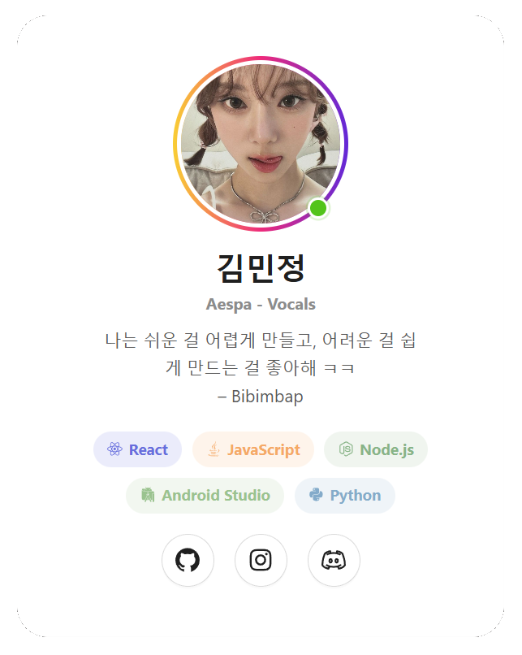

<h2 align="center">Simple Profile Card</h2>

  

<h1 align="center">About</h1>

This project is a small React app that shows a basic user profile card using static information. It is not a big app or a fancy system — it is just a simple page made to practice UI design, component structure, and styling.

The goal was to make a profile look more alive even though the content itself is static. The design starts simple, then gets a little more interesting with hover effects, soft animations, and colorful tags.

## What I used

- React
- Vite
- Ant Design
- React Icons

The main idea was to keep things easy to understand and beginner-friendly while still making the page feel more dynamic.

## What this project does

- displays a profile image
- shows a name and role
- includes a short bio
- lists tech stack items as capsule shi
- uses hover effects to make the UI feel more lively
- keeps the data static, since this is just a simple profile card and not a full app with real user data

## Why it is simple

This is basically a static profile page. There are no backend connections, no login system, and no live data. It is just a clean example of how to structure user information and style it using components.

The project is meant to practice:

- importing assets
- using components from Ant Design
- creating reusable UI elements
- making static content feel more interactive with hover states

## Notes

This project is a good starting point if you want to build more personal profile pages or mini portfolio cards later. The design is simple now, but it already has some life in it because of the hover details and color transitions.

It is not a professional app yet, but it is a clean little UI project that helps practice front-end basics.
